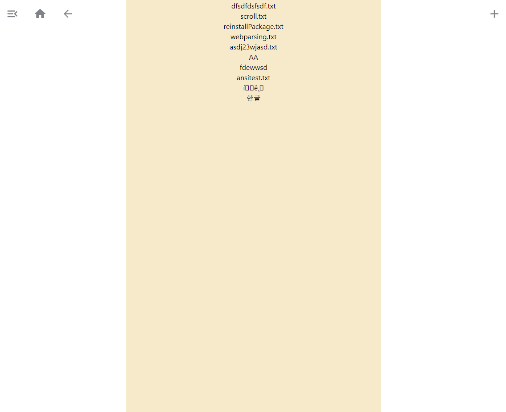
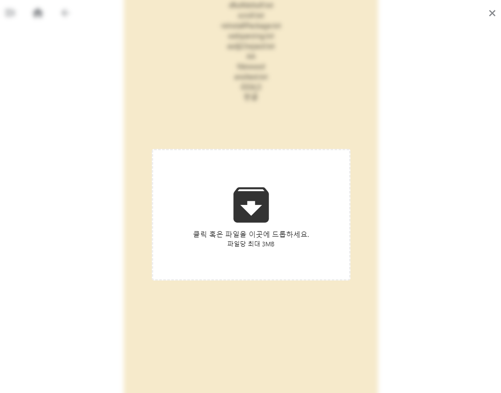
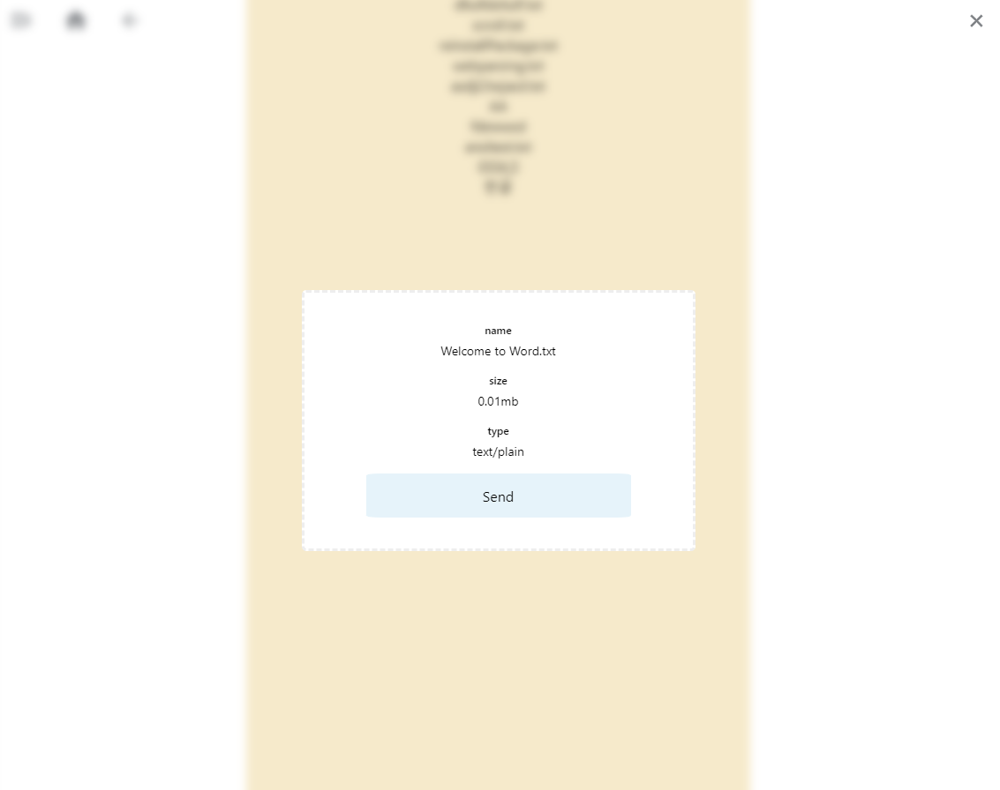
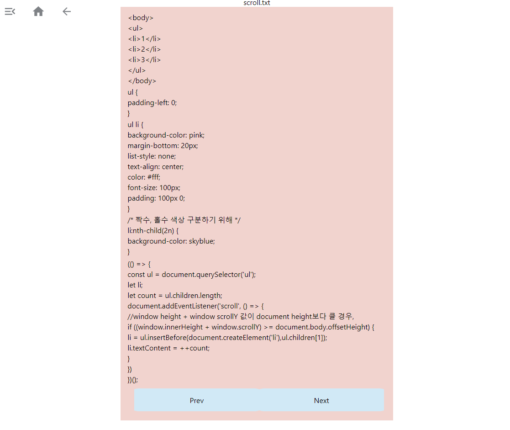

8/10
이 프로젝트는 내가 사용할 Text Viewer 겸 Storage이다.

frontEnd로는 요즘 많이 유행하는 React를 사용할 예정이고
backEnd로는 간단하게 Express를 사용할 예정이다.

test

build 방법
```
cd backEnd && node main
cd FrontEnd && npm run dev
```


프로젝트 중 각종오류
```
폴더에 화살표가 뜨며 업로드가 안되는 현상
그 폴더의 .git 폴더를 지우고
git rm --cached . -rf 
후 다시 add commit push 
```

todo.
```
인코딩 맞추기, 이전 정보 저장, 로그인 및 개인 설정
```




